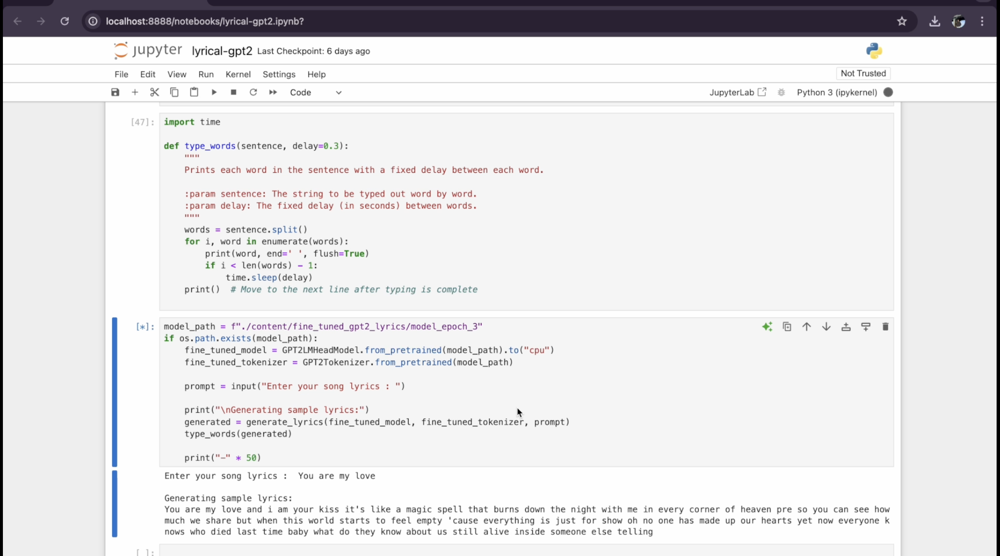

# Fine-Tuned GPT-2 Model for Song Lyrics Generation

This repository contains a Jupyter notebook implementing a fine-tuned version of the GPT-2 model for generating song lyrics. The model was trained on a dataset of lyrics from various American singers to produce creative and coherent song lyrics based on user prompts.

## Overview

This project leverages the GPT-2 language model, fine-tuned specifically for the task of lyric generation. By training on a diverse collection of American song lyrics, the model has learned patterns, styles, and structures common in popular music, enabling it to generate unique and contextually relevant lyrics.

## Dataset

The model was trained on a dataset compiled from song lyrics by a variety of American singers. This dataset was processed and tokenized into a format suitable for the GPT-2 architecture. The tokenized data is stored in the `combined_artists_tokenized.csv` file.

## Training Process

The fine-tuning process involved adapting a pre-trained GPT-2 model (`gpt2`) using the collected lyric dataset. Key steps included:

*   **Data Preparation**: Lyrics were loaded, converted from token strings to lists, and organized into a PyTorch Dataset (`LyricsDataset`). Sequences were padded or truncated to a fixed length (1024 tokens).
*   **Model and Tokenizer**: The standard `gpt2` model and tokenizer from the `transformers` library were utilized.
*   **Configuration**: Training was performed using the AdamW optimizer and a linear learning rate scheduler over 3 epochs with a batch size of 4.
*   **Hardware**: Training was configured to use a GPU if available, otherwise defaulting to CPU.
*   **Model Saving**: The fine-tuned model and tokenizer were saved based on validation loss to the `fine_tuned_gpt2_lyrics` directory.

## How to Use the Model

To generate song lyrics using the fine-tuned model via the provided Jupyter notebook:

1.  **Clone the Repository**: Obtain a copy of this repository.
2.  **Install Dependencies**: Install the required libraries. A `requirements.txt` file listing dependencies (e.g., `pandas`, `numpy`, `torch`, `transformers`, `tqdm`, `sklearn`) may be needed.
    ```bash
    pip install -r requirements.txt
    ```
3.  **Open the Notebook**: Launch Jupyter Notebook or JupyterLab and open `lyrical-gpt2.ipynb` in the `FINE_TUNE` directory.
4.  **Execute Cells**: Run the notebook cells sequentially.
    *   Initial cells handle setup, data loading, and preprocessing.
    *   Training cells (Epochs 1-3) can be run to train the model. This step is time-consuming. If the `fine_tuned_gpt2_lyrics` directory exists from a previous run, these cells can be skipped.
    *   Final cells load the saved model and tokenizer and provide the lyric generation functionality.
5.  **Generate Lyrics**: In the final cell block, you will be prompted to enter a starting phrase. The model will then generate a continuation of the lyrics.

## Demonstration

A demonstration video (`Sample.mp4`) is included in this repository to showcase the model's lyric generation capabilities.

**Note on Video Display on GitHub:** Direct embedding of video files using HTML `<video>` tags is generally not supported on the GitHub website for security reasons.

To view the demonstration video:

*   **Download**: Click on the `Sample.mp4` file in the repository file list to download and play it locally.
*   **Direct Link**: Access the video directly via this link: [Sample.mp4](Sample.mp4).

Below is a screenshot illustrating the lyric generation process within the Jupyter notebook:



## Conclusion

This fine-tuned GPT-2 model provides a tool for automated song lyric generation, trained on a dataset of American singers' lyrics. We encourage users to experiment with the model and explore its creative potential.

For questions or feedback, please feel free to reach out.